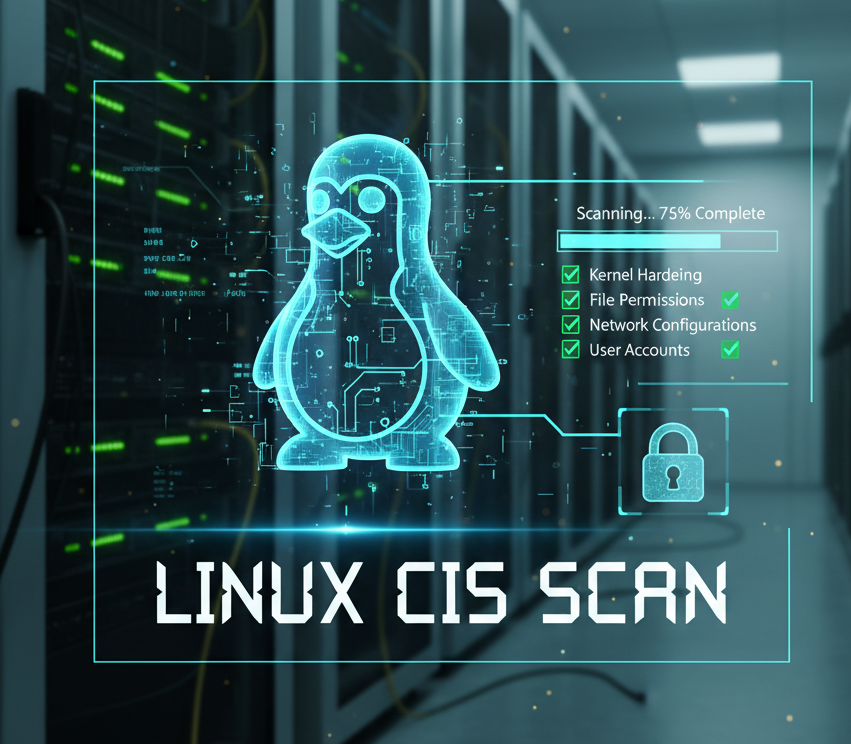

```
██╗   ██╗██╗     ██╗███████╗███╗   ██╗███████╗██╗  ██╗
██║   ██║██║     ██║██╔════╝████╗  ██║██╔════╝╚██╗██╔╝
██║   ██║██║     ██║█████╗  ██╔██╗ ██║█████╗   ╚███╔╝ 
╚██╗ ██╔╝██║██   ██║██╔══╝  ██║╚██╗██║██╔══╝   ██╔██╗ 
 ╚████╔╝ ██║╚█████╔╝███████╗██║ ╚████║███████╗██╔╝ ██╗
  ╚═══╝  ╚═╝ ╚════╝ ╚══════╝╚═╝  ╚═══╝╚══════╝╚═╝  ╚═╝

                 Vijenex CIS Scanner
           Linux Security Compliance
```

# Linux CIS Audit Platform

A comprehensive Python-based security auditing platform for Linux systems based on official Center for Internet Security (CIS) benchmarks. Supports multiple Linux distributions with dedicated audit modules.

## 🔓 **OPEN SOURCE SOFTWARE**
This repository contains open source software under MIT License. **CONTRIBUTIONS WELCOME**. See [LICENSE](LICENSE) for full terms.

## 📋 Overview

This platform provides automated security compliance auditing for Linux systems against official CIS (Center for Internet Security) benchmarks. It performs comprehensive security assessments without making any system changes - **audit-only mode**.



### ✨ Key Features

- **🐧 Multi-Distribution Support**: Dedicated modules for Ubuntu, RHEL, CentOS, Debian
- **📋 Official CIS Compliance**: Strictly follows official CIS benchmark documentation
- **🛡️ Multiple Check Types**: File permissions, services, kernel parameters, packages, configurations
- **📊 Detailed Reporting**: Generates HTML and CSV reports with remediation guidance
- **🚫 Audit-Only**: No system modifications - safe to run in production
- **⚡ Automated**: Minimal user interaction required
- **🐍 Python-Based**: Cross-platform compatibility and easy maintenance
- **🎨 Clean CLI Interface**: Color-coded results and clear output
- **📊 Progress Tracking**: Live scan progress with detailed status
- **🔍 Auto OS Detection**: Automatically detects Ubuntu version and stores reports in dedicated OS folders
- **📁 Smart Directory Management**: Uses correct milestone files and report directories based on detected OS version


### 🎯 Supported Check Types

| Type | Description | Coverage |
|------|-------------|----------|
| **FilePermission** | File and directory permissions/ownership | System files, configs, executables |
| **Service** | Systemd service status and configuration | Critical services, unnecessary services |
| **KernelParameter** | Kernel runtime parameters via sysctl | Network security, memory protection |
| **Package** | Installed package verification | Required/prohibited software |
| **ConfigFile** | Configuration file content validation | Security settings, policy enforcement |
| **Manual** | Human verification required | Complex configurations, policy reviews |

## 🗂️ Repository Structure

```
├── ubuntu-22.04/              # Ubuntu 22.04 LTS CIS audit tools ✅ COMPLETE
│   ├── scripts/
│   │   └── vijenex-cis.py           # Main scanner engine
│   ├── milestones/                  # CIS control definitions (19 files)
│   │   ├── milestone-1-1.json       # Filesystem Configuration
│   │   ├── milestone-1-2.json       # Package Management
│   │   ├── milestone-2-1.json       # Server Services
│   │   ├── milestone-5-1.json       # SSH Configuration
│   │   └── ...                      # 15 more milestone files
│   └── README.md                    # Ubuntu 22.04 specific documentation
├── ubuntu-24.04/              # Ubuntu 24.04 LTS tools (planned)
├── rhel-8/                    # Red Hat Enterprise Linux 8 tools
├── rhel-9/                    # Red Hat Enterprise Linux 9 tools
├── centos-7/                  # CentOS 7 tools
├── debian-11/                 # Debian 11 tools
└── LICENSE                    # MIT License
```

## 🚀 Quick Start

### Prerequisites
- Supported Linux distribution (see distribution-specific folders)
- Python 3.6 or later
- **Root privileges** (recommended for complete scanning)

### Installation

#### Option 1: Local Execution (Recommended for Downloads)

**Latest Release (Stable):**
```bash
# Download and extract
wget https://github.com/vijenex/linux-cis-scanner/archive/refs/tags/v1.0.9.tar.gz
tar -xzf v1.0.9.tar.gz
cd linux-cis-scanner-1.0.9

# Run locally (reports stored in ./reports/)
sudo ./vijenex-cis
```

#### Option 2: System-wide Installation

```bash
# After downloading and extracting (see above)
# Install globally with OS-specific report directories in /var/log
chmod +x install.sh
sudo ./install.sh

# Run from anywhere
vijenex-cis
```

**Development Version:**
```bash
# Clone the repository
git clone https://github.com/vijenex/linux-cis-scanner.git
cd linux-cis-scanner

# Make installer executable and install
chmod +x install.sh
sudo ./install.sh
```

**Specific Version:**
```bash
# Install specific version (replace v1.0.2 with desired version)
git clone --branch v1.0.9 https://github.com/vijenex/linux-cis-scanner.git
cd linux-cis-scanner
chmod +x install.sh
sudo ./install.sh
```

### Usage

#### Local Execution (from downloaded release)
```bash
# Complete compliance scan (reports in ./reports/)
sudo ./vijenex-cis

# Level 2 profile scan
sudo ./vijenex-cis --profile Level2

# Custom output directory
sudo ./vijenex-cis --output-dir /tmp/my-reports

# Specific report formats
sudo ./vijenex-cis --format html
sudo ./vijenex-cis --format csv

# Get help
./vijenex-cis --help
```

#### System-wide Installation Commands
```bash
# Complete compliance scan (reports in /var/log/vijenex-cis/)
sudo vijenex-cis

# Level 2 profile scan
sudo vijenex-cis --profile Level2

# Custom output directory
sudo vijenex-cis --output-dir /tmp/my-reports

# Generate specific report formats
sudo vijenex-cis --format html
sudo vijenex-cis --format csv

# Get help and manual
vijenex-cis --help
man vijenex-cis
```

#### Alternative Usage (without installation)
```bash
# Navigate to your distribution folder (e.g., ubuntu-22.04)
cd ubuntu-22.04

# Run directly with Python
sudo python3 scripts/vijenex-cis.py --output-dir ./reports --profile Level1

# Generate only HTML report
sudo python3 scripts/vijenex-cis.py --format html --output-dir ./reports

# Generate only CSV report
sudo python3 scripts/vijenex-cis.py --format csv --output-dir ./reports

# Run specific milestones
sudo python3 scripts/vijenex-cis.py --milestones milestone-1-1.json milestone-5-1.json
```

### Parameters

| Parameter | Description | Default | Example |
|-----------|-------------|---------|---------|
| `--output-dir` | Report output directory | `./reports` | `--output-dir /var/log/audit` |
| `--profile` | CIS profile level | `Level1` | `--profile Level2` |
| `--format` | Report format | `both` | `--format html` or `--format csv` |
| `--milestones` | Specific milestone files | All files | `--milestones milestone-1-1.json milestone-5-1.json` |
| `--cleanup` | Delete scanner files after scan | `false` | `--cleanup` (keeps reports only) |

## 📊 Report Output

The tool generates comprehensive reports with detailed system information and **automatically stores them in the correct OS-specific directory**:

### 🔍 Automatic OS Detection & Directory Management
- **Smart OS Detection**: Automatically reads `/etc/os-release` to detect Ubuntu version (20.04, 22.04, 24.04)
- **Global Installation**: After `sudo ./install.sh`, reports stored in `/var/log/vijenex-cis/ubuntu-{version}-reports/`
- **Local Development**: When running locally, stores reports in `ubuntu-{version}/reports/` based on detected OS
- **Correct Milestone Loading**: Uses appropriate `ubuntu-{version}/milestones/` for CIS controls
- **Global Command**: Run `vijenex-cis` from anywhere after installation - reports always go to correct OS-specific directory

### 🎨 CLI Output
- **Vijenex ASCII Banner**: Clean branding display
- **Green ✓**: PASSED controls
- **Red ✗**: FAILED controls
- **Yellow ⚠**: MANUAL verification required
- **Cyan ?**: SKIPPED controls
- **Progress Indicators**: Real-time scan status updates

### 📄 HTML Report (`vijenex-cis-report.html`)
- **System Information**: Distribution, kernel, IP address, scan date
- **Visual dashboard** with pass/fail summary
- **Detailed findings** with descriptions and impact
- **Remediation guidance** for each control
- **Color-coded results** for easy identification

### 📈 CSV Report (`vijenex-cis-results.csv`)
- **Structured data** for analysis and tracking
- **Import-friendly** format for spreadsheet applications
- **Compliance tracking** over time
- **Integration** with security dashboards

### 📚 CIS Documentation
- **Official CIS benchmark guide** reference
- **Detailed remediation steps** for each control
- **Best practice recommendations**

## 🎯 CIS Coverage

### Currently Supported Distributions

#### Ubuntu 20.04 LTS (Planned)
| Section | Controls | Coverage |
|---------|----------|----------|
| **1** Initial Setup | 20+ | Filesystem, updates, integrity, boot security |
| **2** Services | 15+ | Service configuration and hardening |
| **3** Network Configuration | 25+ | Network parameters and firewall |
| **4** Logging and Auditing | 20+ | System logging and audit configuration |
| **5** Access, Authentication | 30+ | User accounts, SSH, PAM configuration |
| **6** System Maintenance | 10+ | System file permissions and maintenance |

**Total: 120+ Security Controls**

#### Ubuntu 22.04 LTS ✅ **COMPLETE**
| Section | Controls | Coverage |
|---------|----------|----------|
| **1** Initial Setup | 60+ | Filesystem, packages, AppArmor, bootloader |
| **2** Services | 45+ | Server/client services, time sync, schedulers |
| **3** Network Configuration | 30+ | Network parameters, kernel modules |
| **4** Host Based Firewall | 15+ | UFW and nftables configuration |
| **5** Access Control | 50+ | SSH, privilege escalation, PAM, user accounts |
| **6** Logging and Auditing | 65+ | System logging, auditd, filesystem integrity |
| **7** System Maintenance | 25+ | File permissions, user/group settings |

**Total: 290+ Security Controls**

### Planned Distributions
- **Ubuntu 24.04 LTS** - In development
- **Ubuntu 20.04 LTS** - In development
- **Red Hat Enterprise Linux 8** - In development
- **Red Hat Enterprise Linux 9** - In development  
- **CentOS 7** - In development
- **Debian 11** - In development

> All implementations strictly follow official CIS benchmark documentation for each respective distribution version.

## 🔧 Understanding Results

### Result Status
- ✅ **PASS**: Control is properly configured
- ❌ **FAIL**: Control needs attention or configuration
- ⚠️ **MANUAL**: Requires human verification (not a failure)
- ⏭️ **SKIPPED**: Not applicable to selected profile

### Common "FAIL" Reasons
1. **Default Linux Settings**: Fresh installations lack security hardening
2. **Missing Packages**: Security tools not installed (AIDE, fail2ban, etc.)
3. **Permissive Permissions**: Default file permissions too open
4. **Disabled Security Features**: ASLR, core dump restrictions not configured
5. **Service Configuration**: Unnecessary services enabled

## 🛠️ Troubleshooting

### Common Issues

#### Permission Denied Errors
```bash
# Run with sudo for complete scanning
sudo python3 scripts/linux-cis-scanner.py
```

#### Python Not Found
```bash
# Install Python 3
sudo apt update && sudo apt install python3  # Ubuntu/Debian
sudo yum install python3                     # RHEL/CentOS
```

#### Missing Dependencies
```bash
# Most checks use built-in Python modules
# No additional dependencies required
```

#### High Failure Rate
- **Expected behavior** for default Linux installations
- Use reports to identify actual security gaps
- Focus on "PASS" vs "MANUAL" vs genuine "FAIL" items
- Prioritize based on your security requirements

## 📋 Best Practices

### Before Running
1. **Backup system** (recommended for production)
2. **Review scope** - start with specific milestones
3. **Plan remediation** - have change management process ready
4. **Test in non-production** first

### After Running
1. **Review HTML report** for executive summary
2. **Analyze CSV data** for detailed findings
3. **Prioritize fixes** based on risk and impact
4. **Document exceptions** for accepted risks
5. **Schedule regular scans** for compliance monitoring

### Security Considerations
- **Run as root** for complete system access
- **Secure report files** - contain sensitive system information
- **Regular updates** - keep CIS benchmarks current
- **Validate findings** in your specific environment

## 🤝 Contributing

### 🐛 Issue Reporting
We welcome issue reports and feature requests:

1. **Search existing issues** before creating new ones
2. **Use issue templates** when available
3. **Provide detailed information**:
   - Linux distribution and version
   - Python version
   - Error messages (full text)
   - Steps to reproduce
   - Expected vs actual behavior

### 📝 Issue Guidelines
- **Security vulnerabilities**: Contact maintainers privately
- **Feature requests**: Describe use case and business value
- **Bug reports**: Include system information and logs
- **Questions**: Check documentation first

## 📞 Support

- **Issues**: Use GitHub Issues for bug reports and feature requests
- **Documentation**: Refer to included CIS benchmark guides
- **Updates**: Watch repository for new releases

## ⚖️ Legal

### License
This software is open source under MIT License. See [LICENSE](LICENSE) for complete terms.

### Disclaimer
- **No warranty** provided - use at your own risk
- **Audit-only tool** - makes no system changes
- **CIS compliance** - based on official CIS benchmarks
- **Your responsibility** - validate findings in your environment

### CIS Benchmarks
This tool implements controls from CIS (Center for Internet Security) benchmarks. CIS benchmarks are developed by cybersecurity experts and are freely available at [cisecurity.org](https://www.cisecurity.org/).

---

## 🏷️ Releases

### Current Stable Release
- **v1.0.9** - Ubuntu 22.04 LTS CIS Scanner with Official CIS Benchmark References
  - Complete CIS benchmark implementation (290+ controls)
  - Auto OS detection from /etc/os-release
  - Smart directory management for Ubuntu versions
  - Optional --cleanup flag to remove scanner files after scan
  - Clean CLI with color-coded output
  - System-wide installation with man pages
  - HTML and CSV reporting with proper Vijenex branding
  - Automatic reports folder creation
  - Zero false positive design
  - 19 milestone files covering 7 major CIS sections

### Download Options
```bash
# Latest stable release
wget https://github.com/vijenex/linux-cis-scanner/archive/refs/tags/v1.0.9.tar.gz

# All releases
# Visit: https://github.com/vijenex/linux-cis-scanner/releases
```

### Version Information
- **Current Version**: v1.0.9
- **Supported Distributions**: Ubuntu 22.04 LTS
- **CIS Compliance**: Based on official CIS benchmark documentation
- **Release Date**: November 2024

---

**⭐ If this tool helps secure your Linux environment, please star the repository!**

**🔓 Remember: This is open source software under MIT License - contributions welcome!**